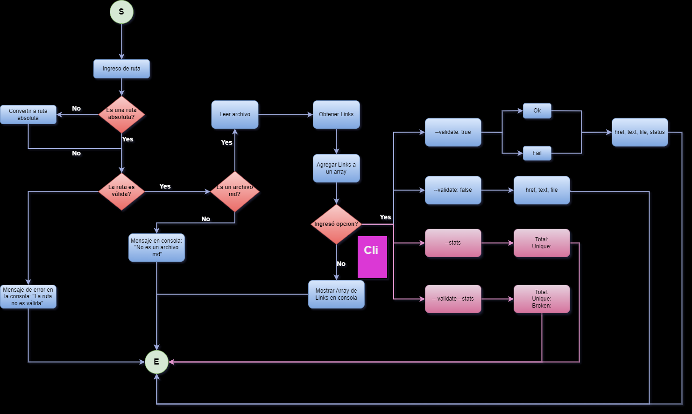

# md-links-gabyolvera

## Table of contents

* [1. Description](#1-description)
* [2. Install](#2-install)
* [3. Usage](#3-usage)
* [4. Results](#4-results)
* [5. Flowchart](#5-flowchart)

***
<p align="center">
  
</p>

## 1. Description

This npm package is a tool that implements a Command Line Interface (CLI) to facilitate the validation of Markdown (md) files and extract the links found in them. The main objective is to provide the user with the ability to parse md files and obtain relevant information about the links present in them.
## 2. Install

To install the "md-links" package, make sure you have Node.js and npm installed on your system. Then, run the following command in your terminal or command line:

```
npm i md-links-gabyolvera
```

To install it globally use:

```
npm i -g md-links-gabyolvera
```
## 3. Usage

Once the package is installed, you can use the following command in the command line:

```
md-links <path-to-file> [options]
```

Replace <path-to-file> with the path to the file you want to search for links in. Be sure to provide the full or relative path to the file.

### Options

You can use the following additional options to perform extra validations or obtain link statistics:

* `--validate`: This option validates the links found, verifying if they are active and accessible. It returns information about the status of each link.

* `--stats`: This option displays general statistics about the links found in the archive, such as the total link count.

You can combine both options to get validations and statistics at the same time.

Examples of the use of options:

* To search for links and validate them:
```
md-links <path-to-file> --validate
```

* To search for links and obtain statistics:
```
md-links <path-to-file> --stats
```

* To search for links, validate them and obtain statistics:
```
md-links <path-to-file> --validate --stats

md-links <path-to-file> --stats --validate
```

## 4. Results

After executing the command with the corresponding options and file path, the "md-links" package will display the requested information on the command line, including the links found, their status (if --validate is used) and general statistics (if --stats is used).

## 5. Flowchart

